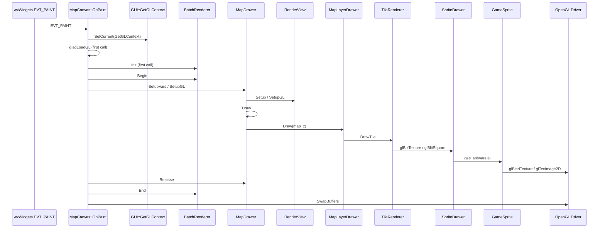
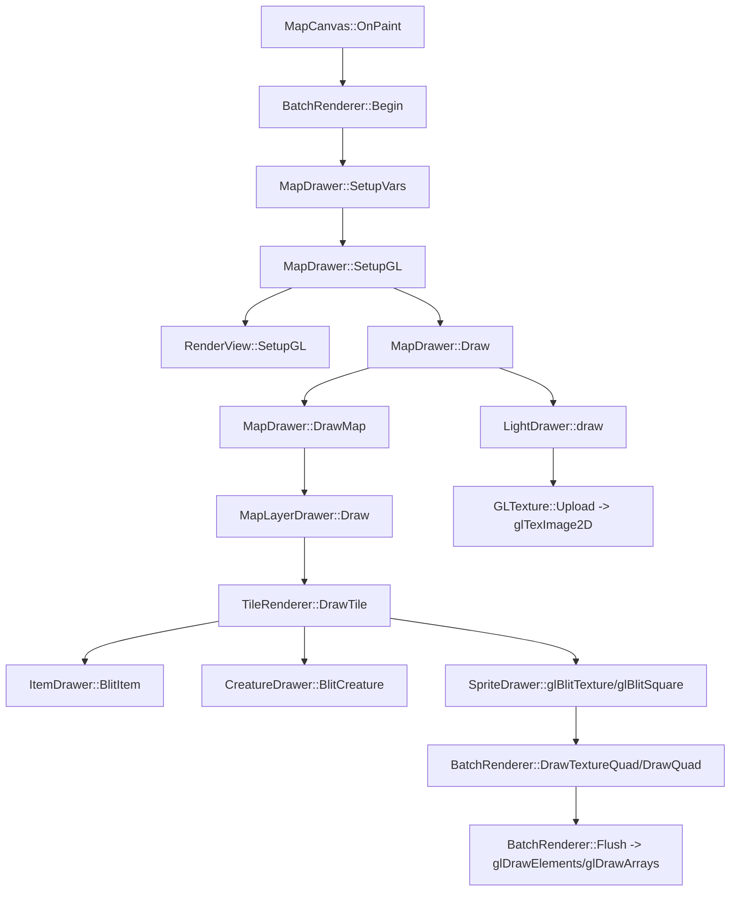
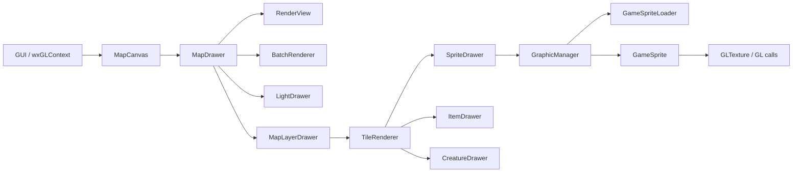
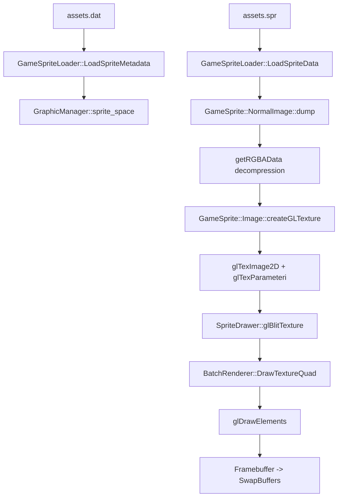

# Remere’s Map Editor Deprecated OpenGL Rendering Pipeline

## Rendering Entry Point and Frame Lifecycle
The rendering loop is driven by the wxWidgets paint event on the OpenGL canvas. A single shared OpenGL context is created by the GUI subsystem and made current for each paint. Rendering proceeds by preparing view parameters, clearing the framebuffer, drawing map layers, overlays, and lights, then swapping buffers.



## Core Rendering Call Stack Graph


## Subsystem Dependency Graph


## Render State Transitions
```mermaid
stateDiagram-v2
    [*] --> ContextReady: GUI::GetGLContext
    ContextReady --> RendererInit: BatchRenderer::Init
    RendererInit --> FrameBegin: BatchRenderer::Begin
    FrameBegin --> Clear: RenderView::Clear (glClearColor/glClear)
    Clear --> DrawPasses: MapDrawer::Draw
    DrawPasses --> LightBlend: LightDrawer::draw (glBlendFunc)
    LightBlend --> DrawPasses: glBlendFunc reset
    DrawPasses --> FrameEnd: BatchRenderer::End
    FrameEnd --> Swap: SwapBuffers
    Swap --> FrameBegin
```

## Data Flow: SPR/Sprite to GPU Texture to Screen


## Coordinate Systems and Conversions
Coordinate flow uses view scroll offsets, zoom, and floor adjustments to map between screen pixels, map tiles, and the OpenGL orthographic projection.

```mermaid
graph LR
    S[Screen pixels] --> C[CoordinateMapper::ScreenToMap]
    C --> M[Map tile coords]
    M --> R[RenderView::getScreenPosition]
    R --> O[OpenGL world space (ortho)]
```

| Conversion Step | Implementation | Core Formula/Rule |
|---|---|---|
| Screen → Map | rendering/core/coordinate_mapper.cpp | screen is scaled by content scale factor; map = (view_start + screen * zoom) / TileSize; floor shift for above-ground floors |
| Map → Screen | rendering/core/render_view.cpp | screen = map * TileSize - view_scroll - floor offset |
| Screen → OpenGL world | rendering/core/render_view.cpp | glm::ortho(0, width*zoom, height*zoom, 0, -1, 1) with viewMatrix translate(0.375, 0.375, 0) |

## Deprecated OpenGL and Fixed-Function Usage
Immediate mode is not used directly; legacy-style drawing is emulated by the batch renderer. Fixed-function state is still manipulated for blending, viewport, and texture upload.

| OpenGL API | File / Function | Usage |
|---|---|---|
| glBegin / glEnd | Not present | Immediate mode is not called; GL_QUADS is emulated in BatchRenderer::SubmitVertex |
| glVertex / glTexCoord | Not present | Vertex submission is via BatchRenderer and VBO uploads |
| glMatrixMode / glLoadIdentity | rendering/core/render_view.cpp (comments) | Legacy equivalents noted, replaced by glm::ortho and glm::translate |
| glViewport | rendering/core/render_view.cpp | Sets viewport each frame in RenderView::SetupGL |
| glClearColor / glClear | rendering/core/render_view.cpp | Clears color and depth buffer in RenderView::Clear |
| glBlendFunc / glEnable(GL_BLEND) | rendering/core/render_view.cpp, rendering/utilities/light_drawer.cpp | Global alpha blending; light pass switches blend function |
| glBindTexture / glTexParameteri / glTexImage2D | rendering/core/graphics.cpp, rendering/core/gl_texture.cpp | Sprite and light texture upload |
| glDeleteTextures / glGenTextures | rendering/core/gl_texture.cpp, rendering/core/graphics.cpp | Texture lifecycle management |
| glReadPixels / glPixelStorei / glFinish | rendering/io/screen_capture.cpp | Screenshot capture path |
| glDrawElements / glDrawArrays | rendering/core/batch_renderer.cpp | Actual draw submission |

## Texture and Sprite Loading / Unpacking
| Stage | File(s) | Details |
|---|---|---|
| OTFI discovery and metadata selection | rendering/io/game_sprite_loader.cpp | Reads .otfi to locate .dat/.spr and flags for transparency and format |
| Sprite metadata parsing | rendering/io/game_sprite_loader.cpp | Reads .dat and creates GameSprite entries with sizes, patterns, frames, and sprite IDs |
| Sprite data loading | rendering/io/game_sprite_loader.cpp | Reads .spr index table and optionally caches sprite dump data |
| Sprite decompression | rendering/core/graphics.cpp | NormalImage::getRGBData/getRGBAData expands run-length encoded sprite data |
| Texture creation | rendering/core/graphics.cpp | GameSprite::Image::createGLTexture uses glTexImage2D with GL_NEAREST filters |
| Texture lifecycle | rendering/core/gl_texture.cpp, rendering/core/texture_garbage_collector.cpp | Explicit GL texture release and timed cleanup |

## Optimization Techniques
| Technique | File(s) | Notes |
|---|---|---|
| Batch rendering | rendering/core/batch_renderer.cpp | Batches quads/lines to reduce draw calls; emulates immediate mode submission |
| Viewport culling | rendering/core/render_view.cpp, rendering/drawers/tiles/tile_renderer.cpp | IsTileVisible skips tiles fully off-screen |
| Node-based map traversal | rendering/drawers/map_layer_drawer.cpp | Traverses 4x4 QTree nodes with visibility and request logic |
| Texture garbage collection | rendering/core/texture_garbage_collector.cpp | Time-based cleanup to limit GPU memory usage |
| Sprite dump caching | rendering/core/graphics.cpp | Conditional dump retention; optional memcached sprite usage |
| Minimap/only-color mode | rendering/drawers/tiles/tile_renderer.cpp | Uses solid color quads for faster rendering |

## Error Handling and Recovery
| Location | Mechanism | Behavior |
|---|---|---|
| rendering/ui/map_display.cpp | gladLoadGL return check | No fallback, assumes context success |
| rendering/io/game_sprite_loader.cpp | file open checks + error strings | Returns false and populates error message |
| rendering/io/game_sprite_loader.cpp | safe_get macro | Early return on read failure with error |
| rendering/core/graphics.cpp | loadSpriteDump failure | Returns nullptr and skips texture creation |

## File Responsibility Tables

### Rendering Orchestration and Draw Passes
| File | Responsibility |
|---|---|
| rendering/map_drawer.cpp, rendering/map_drawer.h | Frame setup, draw order, and orchestration of map layers, overlays, and lighting |
| rendering/drawers/map_layer_drawer.cpp, rendering/drawers/map_layer_drawer.h | Iterates map nodes and dispatches per-tile rendering |
| rendering/drawers/tiles/tile_renderer.cpp, rendering/drawers/tiles/tile_renderer.h | Per-tile draw logic, culling, item/creature/overlay dispatch |
| rendering/drawers/tiles/floor_drawer.cpp, rendering/drawers/tiles/floor_drawer.h | Transparent higher-floor rendering |
| rendering/drawers/tiles/shade_drawer.cpp, rendering/drawers/tiles/shade_drawer.h | Floor shading between stacked levels |
| rendering/drawers/tiles/tile_color_calculator.cpp, rendering/drawers/tiles/tile_color_calculator.h | Tile color computation for minimap/filters |
| rendering/drawers/overlays/grid_drawer.cpp, rendering/drawers/overlays/grid_drawer.h | Grid lines, ingame box, node loading markers |
| rendering/drawers/overlays/selection_drawer.cpp, rendering/drawers/overlays/selection_drawer.h | Selection overlay rendering |
| rendering/drawers/overlays/brush_overlay_drawer.cpp, rendering/drawers/overlays/brush_overlay_drawer.h | Brush preview overlay rendering |
| rendering/drawers/overlays/marker_drawer.cpp, rendering/drawers/overlays/marker_drawer.h | Waypoint/house/spawn markers |
| rendering/drawers/overlays/preview_drawer.cpp, rendering/drawers/overlays/preview_drawer.h | Preview layer rendering for brush previews |
| rendering/drawers/cursors/brush_cursor_drawer.cpp, rendering/drawers/cursors/brush_cursor_drawer.h | Brush cursor overlay |
| rendering/drawers/cursors/drag_shadow_drawer.cpp, rendering/drawers/cursors/drag_shadow_drawer.h | Drag shadow overlay |
| rendering/drawers/cursors/live_cursor_drawer.cpp, rendering/drawers/cursors/live_cursor_drawer.h | Live-edit cursor overlay |
| rendering/drawers/entities/sprite_drawer.cpp, rendering/drawers/entities/sprite_drawer.h | Low-level sprite quad submission |
| rendering/drawers/entities/item_drawer.cpp, rendering/drawers/entities/item_drawer.h | Item draw rules, patterns, and filtering |
| rendering/drawers/entities/creature_drawer.cpp, rendering/drawers/entities/creature_drawer.h | Creature/outfit rendering |
| rendering/drawers/minimap_drawer.cpp, rendering/drawers/minimap_drawer.h | Minimap rendering |

### OpenGL Context and State Management
| File | Responsibility |
|---|---|
| gui.cpp, gui.h | Creates and owns wxGLContext (core profile 4.5 on non-OSX) |
| rendering/ui/map_display.cpp, rendering/ui/map_display.h | wxGLCanvas paint handling, context binding, buffer swap |
| rendering/core/render_view.cpp, rendering/core/render_view.h | Viewport, projection setup, clear/blend state |
| rendering/core/batch_renderer.cpp, rendering/core/batch_renderer.h | VAO/VBO/EBO setup, shader program, draw submission |
| rendering/core/gl_texture.cpp, rendering/core/gl_texture.h | OpenGL texture object wrapper |
| rendering/utilities/light_drawer.cpp, rendering/utilities/light_drawer.h | Light pass blend state and texture upload |
| rendering/io/screen_capture.cpp, rendering/io/screen_capture.h | Readback for screenshots |

### Tibia SPR / Sprite Data Loading
| File | Responsibility |
|---|---|
| rendering/io/game_sprite_loader.cpp, rendering/io/game_sprite_loader.h | Loads .otfi, .dat, .spr and sprite metadata |
| rendering/io/editor_sprite_loader.cpp, rendering/io/editor_sprite_loader.h | Loads editor-specific sprites |
| rendering/core/graphics.cpp, rendering/core/graphics.h | GraphicManager and GameSprite data structures |
| rendering/core/editor_sprite.cpp, rendering/core/editor_sprite.h | Editor sprite representations |
| sprites.h | Sprite ID constants and declarations |

### Texture Lifecycle and Caching
| File | Responsibility |
|---|---|
| rendering/core/graphics.cpp, rendering/core/graphics.h | Texture creation from sprite data, upload parameters |
| rendering/core/gl_texture.cpp, rendering/core/gl_texture.h | Texture object lifecycle and parameter setup |
| rendering/core/texture_garbage_collector.cpp, rendering/core/texture_garbage_collector.h | Cleanup policy and texture lifetime control |
| rendering/core/gl_texture_id_generator.h | Texture ID allocation for templated sprites |

### Tile Draw Operations
| File | Responsibility |
|---|---|
| rendering/drawers/tiles/tile_renderer.cpp, rendering/drawers/tiles/tile_renderer.h | Tile traversal, sprite/creature/item draw dispatch |
| rendering/drawers/entities/item_drawer.cpp, rendering/drawers/entities/item_drawer.h | Item stacking rules and sprite selection |
| rendering/drawers/entities/creature_drawer.cpp, rendering/drawers/entities/creature_drawer.h | Creature rendering, addons/mounts |
| rendering/drawers/entities/sprite_drawer.cpp, rendering/drawers/entities/sprite_drawer.h | Final sprite quad blit |
| rendering/drawers/tiles/floor_drawer.cpp, rendering/drawers/tiles/floor_drawer.h | Transparent floor overlay |

### Paint Event Handling
| File | Responsibility |
|---|---|
| rendering/ui/map_display.cpp, rendering/ui/map_display.h | EVT_PAINT handler and per-frame rendering sequence |

### Coordinate System Conversions
| File | Responsibility |
|---|---|
| rendering/core/coordinate_mapper.cpp, rendering/core/coordinate_mapper.h | Screen → map tile conversion with zoom and floor adjustments |
| rendering/core/render_view.cpp, rendering/core/render_view.h | Map → screen conversion and view bounds |
| rendering/ui/map_display.cpp, rendering/ui/map_display.h | ScreenToMap and view scrolling integration |
